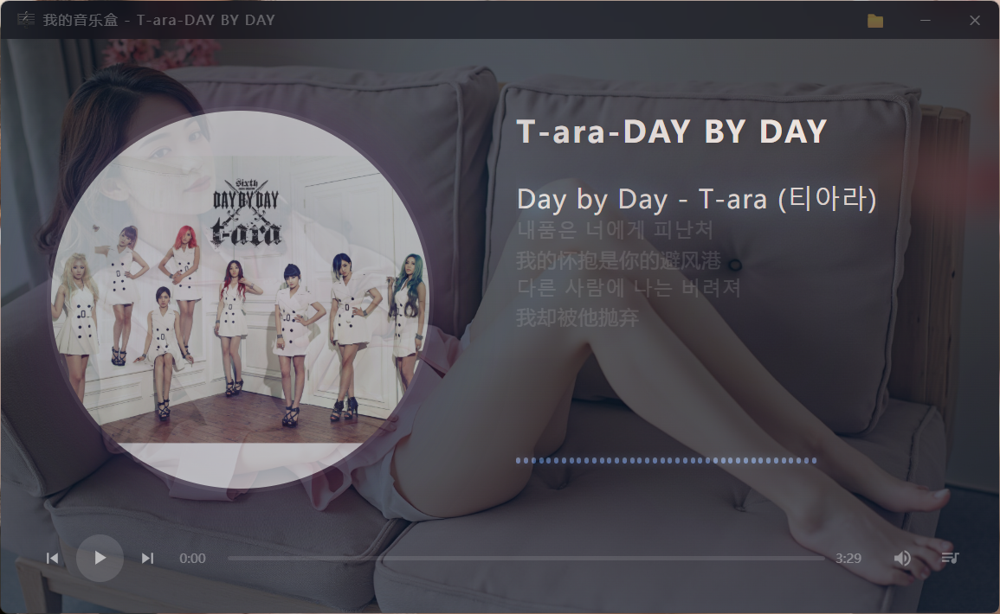

# 我的音乐盒

一款简洁优雅的本地音乐播放器，基于 [Wails](https://wails.io/)（Go + Vue.js）开发。



## 功能特性

### 音乐播放
- 支持 MP3、WAV、FLAC、M4A、OGG、AAC、WMA、APE 等主流音频格式
- 本地 HTTP 音频流服务，高效稳定
- 自动记忆播放位置（切换文件夹后重置）
- 播放完毕自动跳至下一首

### 歌词
- 自动扫描本地歌词文件（与音频文件同名的 `.lrc` 文件，位于 `lyrics` 目录）
- 支持读取音频内嵌歌词（ID3/Vorbis），优先显示内嵌歌词
- 本地未找到时，自动从 [LRCLIB](https://lrclib.net/) 在线下载
- 支持逐行高亮显示，跟随播放进度滚动
- 下载成功后将歌词保存至本地，无需重复下载

### 封面与背景
- 自动匹配专辑封面（`cover` 目录下与歌曲同名的图片文件）
- 自动匹配背景图片（`cover` 目录下名为 `background` 的图片）
- 支持 JPG、PNG、GIF、WebP、BMP 等格式

### 音频可视化
- 实时音频频谱可视化（Web Audio API AnalyserNode）
- 动态音浪条，伴随音乐律动

### 播放列表
- 双栏布局，显示所有歌曲名称和大小
- 内置搜索功能，快速定位歌曲
- 显示歌词标记，标识哪些歌曲已有歌词（内嵌歌词显示"嵌"，本地/下载歌词显示"词"）
- 播放指示器动画，直观显示当前播放

### 多视图模式
- **大屏模式**：完整界面，左侧封面 + 右侧信息面板
- **小屏模式**：紧凑布局，三分之一窗口宽度，适合边工作边听
- **迷你模式**：仅显示当前歌词 + 基本控制，超小窗口

### 快捷操作
- 空格键：播放 / 暂停
- 左右方向键：快退 / 快进 10 秒
- M 键：静音 / 恢复音量
- 进度条支持拖拽定位

### 更多特性
- 音量滑块（点击图标弹出垂直滑块）
- 半透明毛玻璃界面，沉浸式视觉体验
- 自定义标题栏，最小化 / 关闭按钮
- 文件夹切换无需重启
- IndexedDB 本地存储音乐文件夹路径
- 支持半屏模式、迷你模式切换

## 目录结构要求

```
音乐文件夹/
├── 歌曲1.mp3
├── 歌曲2.flac
├── cover/
│   ├── 歌曲1.jpg          (专辑封面)
│   ├── 歌曲2.png          (专辑封面)
│   └── background.jpg     (背景图片，所有歌曲共用)
└── lyrics/
    ├── 歌曲1.lrc          (歌词文件)
    └── 歌曲2.lrc          (歌词文件)
```

> 封面和歌词文件与歌曲同名即可自动匹配，可选放置。背景图片命名为 `background` 即可。

## 快捷键

| 快捷键 | 功能 |
|--------|------|
| `Space` | 播放 / 暂停 |
| `←` | 快退 10 秒 |
| `→` | 快进 10 秒 |
| `M` | 静音 / 恢复（70%） |

## 技术亮点

- **Wails 框架**：原生桌面体验，Go 后端 + Vue.js 前端
- **本地 HTTP 流**：音频通过本地 HTTP 服务器流式播放，高效利用缓存
- **Web Audio API**：实时音频分析，驱动可视化音浪效果
- **目录预扫描**：启动时一次性扫描所有子目录，构建查找表，文件再多也流畅
- **LRCLIB API**：开源歌词数据库，自动匹配下载，摆脱手动找歌词
- **IndexedDB**：浏览器级本地存储，文件夹路径持久化，关闭再打开也记得

## 安装使用

### 预构建版本

下载 `my_music.exe` 双击运行即可。

### 从源码构建

```bash
# 克隆项目
git clone git@github.com:wyzzgzhdcxy/my_music.git
cd my_music

# 安装依赖
go mod download
cd frontend && npm install && cd ..

# 开发模式运行
wails dev

# 构建发布版本
wails build
```

构建产物位于 `build/bin/` 目录。

## 项目结构

```
my_music/
├── app.go                # Go 后端逻辑（音频服务、歌词下载、文件扫描）
├── main.go               # Wails 应用入口
├── frontend/
│   └── src/
│       ├── App.vue       # Vue 主组件（UI、播放控制、状态管理）
│       └── components/   # Vue 组件（MenuPanel、PlaylistPanel）
│           ├── MenuPanel.vue
│           └── PlaylistPanel.vue
├── doc/
│   └── 软件界面.png       # 软件界面截图
└── build/                # 构建资源（图标等）
```

## 开源协议

MIT License
